# Distributed URL Shortener

Small distributed URL shortener for the Scalability Engineering prototype.

See [documentation chapter](#documentation) for further details about the architecture and fullfillment of the requirements.

## What Runs

- `services/api`: FastAPI service on port `8080`
- `services/db`: FastAPI in-memory stores, run as five DB shards locally using shuffle sharding
- Cloud deployment: one public Nginx load balancer VM, configurable private API
  VM count, and configurable private DB shard VM count
- OpenTelemetry Collector, Prometheus, and Grafana for metrics

The API talks to the DB service over HTTP. The DB stores data in Python hash
maps, so all URLs are lost when the DB container restarts.

Note on shuffle sharding: when `DB_URLS` is configured with multiple comma-
separated DB URLs, the API routes each short code to a small, deterministic
replica set using rendezvous hashing. Writes fan out to that set, reads fall
back across it, and `DB_URL` remains supported for single-DB deployments.

## Setup

```bash
gcloud auth login
gcloud config set project scale-eng-prototyping

python3 -m venv .venv
source .venv/bin/activate
python -m pip install -r requirements.txt -r requirements-dev.txt
```

Docker, Terraform, and `gcloud` are required for cloud deployment. The Artifact
Registry repository must exist before pushing images.

## Local Deployment

Run everything with Docker:

```bash
make local
```

Endpoints:

- API: `http://localhost:8080`
- DB shards: `http://localhost:9001` through `http://localhost:9005`
- Grafana: `http://localhost:3000`
- Prometheus: `http://localhost:9090`

## Cloud Deployment

Defaults:

- `PROJECT_ID`: active `gcloud` project
- `REGION`: `europe-west3`
- `ZONE`: `europe-west3-a`
- `REPO_NAME`: `url-shortener`
- `TAG`: output of `whoami`
- `API_SERVER_COUNT`: `5`
- `DB_SERVER_COUNT`: `3`

Build, push, deploy, and wait:

```bash
make build-all
make push-all
make deploy
make wait
```

Print deployment outputs:

```bash
make outputs
```

Run integration tests against the deployed API:

```bash
make test-integration
```

After pushing new images, restart all VMs:

```bash
make restart-all
```

Per-service build, push, and restart targets are also available, for example
`make build-api`, `make push-api`, and `make restart-api`.

Destroy infrastructure:

```bash
make undeploy
```

Terraform manages VMs, networking, firewall rules, service account, and IAM.

## Usage

Set the API URL for local or cloud:

```bash
export API_URL=http://localhost:8080
# or
export API_URL="$(terraform -chdir=infra output -raw base_url)"
```

Create a short URL:

```bash
curl -X POST "$API_URL/create" \
  -H 'Content-Type: application/json' \
  -d '{"url":"https://example.com/some/long/url"}'
```

Response:

```json
{
  "shortUrl": "http://some.domain/a1B2c3D4"
}
```

Follow a short URL:

```bash
curl -i "$API_URL/a1B2c3D4"
```

Known codes return `302`. Unknown codes return `404`. Invalid create payloads
return `400`.

## Load Testing

Install k6, start the service locally or deploy it to cloud, and set `API_URL`.
The wrapper requires one load profile, the target and one test mode:

```bash
./load-tests/run.sh --spike --read --constant-distribution
```

Available profiles:

- `--steady`: moderate constant load.
- `--spike`: fast ramp to high load, then ramp down.
- `--breakpoint`: slowly increases load until thresholds fail or the configured
  maximum is reached.

Available targets:
- `--query`: Test creating short urls
- `--read`: Test reading short urls
- `--mixed`: Test reading & creating short urls

Available read distributions:

- `--constant-distribution`: always reads the same seeded code.
- `--uniform-distribution`: reads evenly across seeded codes.
- `--hotspot-distribution`: skews reads toward a small hot set.

For cloud runs, you may want to run `make restart-db` between load-test runs to
clear the in-memory DB state.

The headline scaling metric is the maximum sustained throughput at the SLO,
measured by the breakpoint profile. To run the core scaling suite (three
breakpoint runs, ~30 min), labelled with the node count:

```bash
./load-tests/run-core.sh 3-node
```

Spike-based overload tests live in a separate suite:

```bash
./load-tests/run-resilience.sh 3-node
```

To run the full matrix of all combinations (~2 h):
```bash
./load-tests/run-all.sh 3-node
```

See [load-tests/README.md](load-tests/README.md) for what each benchmark measures
and how to calibrate the breakpoint ramp.

### Visualize Results

To visualize the results you can run:
```bash
python analyze.py
```

## Development

Validate and auto-fix Python code:

```bash
make validate
```

Integration tests:

```bash
python -m pytest tests_integration
```

## Observability

The Python services start through `opentelemetry-instrument`. Metrics are sent
to the Collector with OTLP over HTTP. Traces and logs are disabled. The metric
export interval is `10000` ms.

To update the Grafana dashboard, make changes in the Grafana UI, export the JSON,
and replace `observability/grafana/dashboards/url-shortener-metrics.json`.

## Testing Sharding 
- Run in docker
- Creating urls ( e.g 
`curl -X POST http://localhost:8080/create \
  -H "Content-Type: application/json" \
  -d '{"url":"https://example.com/a"}'` )
- Call each shard with the value of the created short-url at the end (e.g. curl -i http://localhost:9001/7Dw8Ew42)
- Try with different localhost ports and if the url is not there then "404 Not Found" will pop up or else "200 OK" if it's there
- Test redirect via API with the value of your short-url at the end again 
curl -i http://localhost:8080/7Dw8Ew42

# Documentation

We built a distributed URL shortener.

Its core functionality is deliberately simple:
- **Create Short URL:** you submit a long URL and get a shortened URL back.
- **Access Short URL:** you request a shortened URL and receive a redirect to the original URL in response.

## Architecture

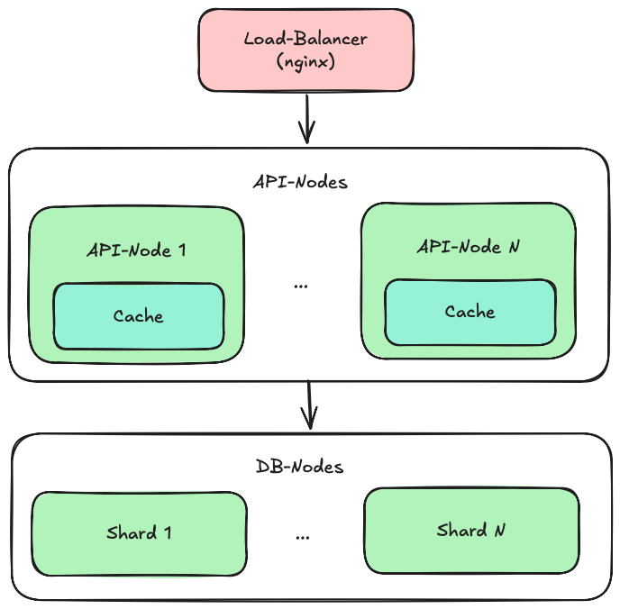

**Load Balancer:**
- We use nginx as the load balancer to distribute incoming requests across the API nodes in round-robin fashion.
- Additional nginx features such as request limiting are intentionally not used.

**API Nodes:**
- The API nodes are plain FastAPI services and form our stateless component.
- They can be scaled horizontally or vertically as needed.

**DB Nodes:**
- The DB nodes are FastAPI in-memory stores that keep the data in a hash map. We deliberately chose not to use a classic database, since for a prototype like this it would only add unnecessary overhead.
- Each DB node is a shard and therefore holds only a subset of the data (hash-based sharding). On top of that we implemented shuffle sharding, so every item is stored on more than one shard.
- They form our stateful component. They can be scaled vertically in the classic way, but thanks to sharding they can also be scaled horizontally.

## How We Tackled the Requirements

We started development with a very simple setup consisting of a single API node and a single DB node. To evaluate the performance our metric of choice was thoughput (req/s) and we used a read-only breakpoint test for testing.

During testing we observed that the API node was the bottleneck in this configuration (see saturation):

**Results of Read-Only Breakpoint Test** 
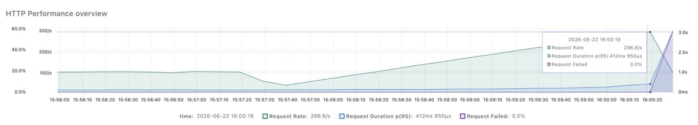
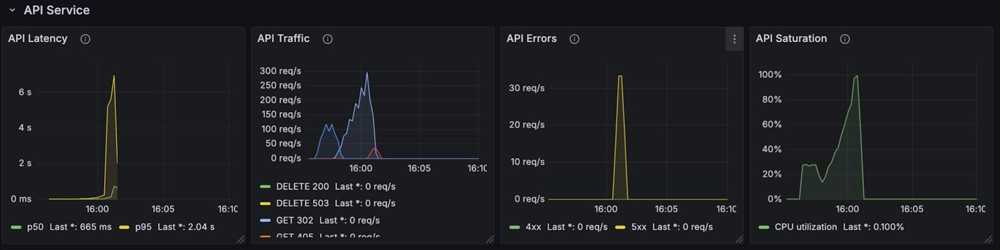
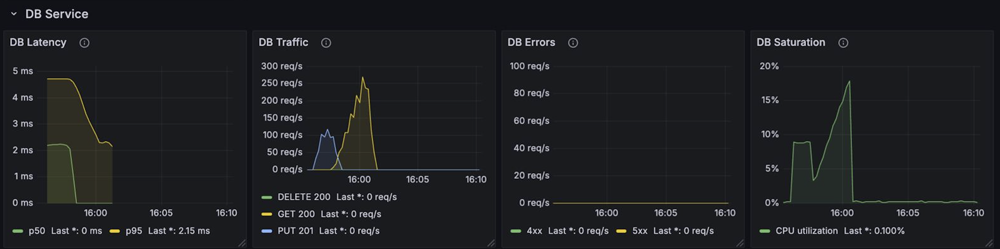

### Scalability

To solve the problem mentioned above we added a load balancer in the form of nginx, which lets us scale the API nodes horizontally with ease. Because this is a stateless component, it can now be scaled out to virtually any number of nodes.
See the [code](infra/startup-lb.sh.tftpl) for details.

With the now higher number of API nodes, the bottleneck shifted towards the DB node:

**Results of Read-Only Breakpoint Test (5 API-Nodes)** 

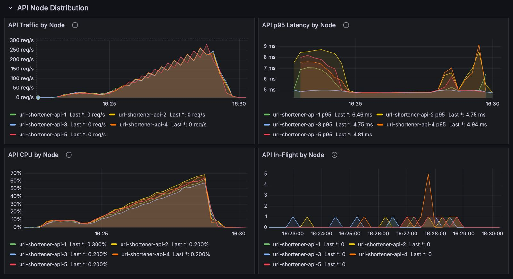
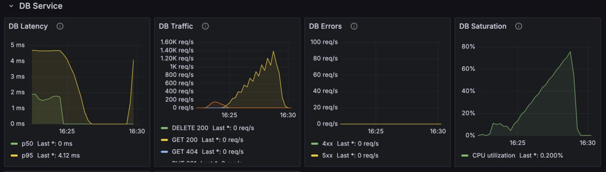


### Strategy 1: Caching

Since a URL shortener typically serves far more read requests than writes, we decided to give each API node its own in-memory LRU cache. These caches significantly reduce the number of requests forwarded to the DB nodes and therefore take load off them.

Because the data stored in a URL shortener is immutable, we did not have to worry about consistency or TTL here.

(Important note: we deliberately kept the caches fairly small to prevent an API node from simply caching the entire dataset.)

See the [code](services/api/cache.py) for details.

This worked very well and allowed us to handle significantly more requests per seconds for the hotspot access pattern:

**Results of Read-Only Breakpoint Test (Hotspot-Distribution, 5 API-Nodes)** 
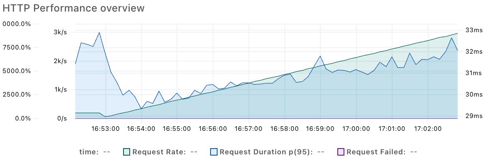
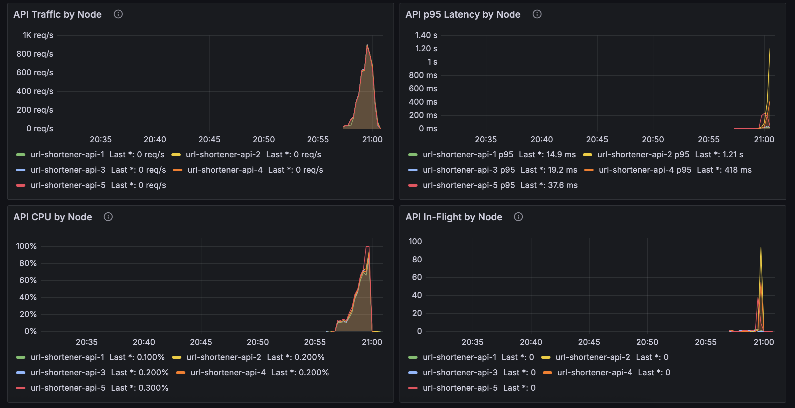
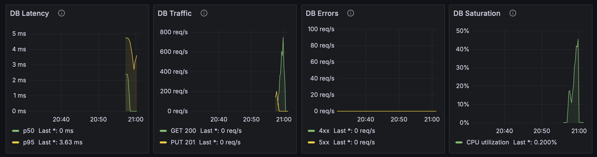

However, caches only help with read requests, and only when the access pattern is somewhat skewed so that many cache hits are possible. For a uniform access pattern the throughput was still limited by the DB-Node:

**Results of Read-Only Breakpoint Test (Uniform-Distribution, 5 API-Nodes)** 
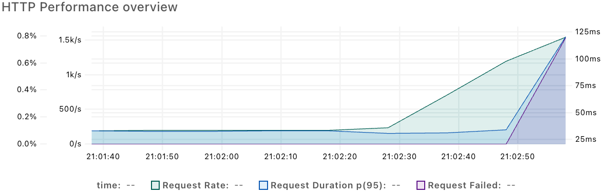
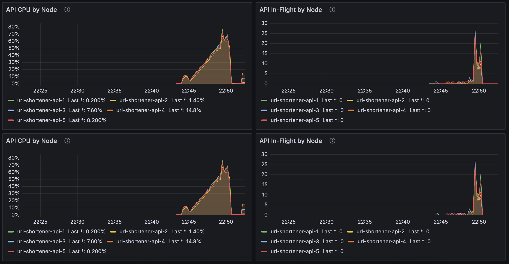
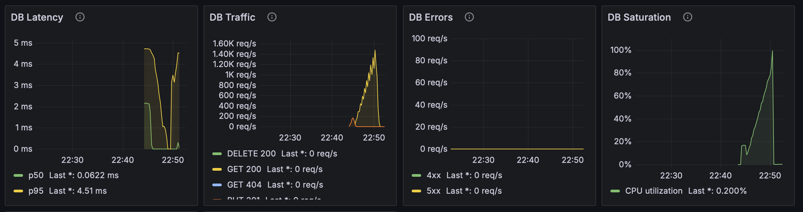


We therefore picked a second strategy to further relieve the DB bottleneck.

### Strategy 2: (Shuffle) Sharding

As a second strategy we implemented shuffle sharding. Each DB node represents one shard that stores a subset of the data. We use hash-based sharding to distribute the data as evenly as possible. On top of that we apply shuffle sharding, so every item is placed on more than one shard, which keeps all data accessible even if a single shard fails. `DB_SHARD_REPLICATION_FACTOR` controls how many shards each code is replicated
to and the replica set for each code is determined deterministically using rendezvous hashing.
See the code in [`services/api/app.py`](services/api/app.py) and [`services/api/sharding.py`](services/api/sharding.py) for details.

With sharding enabled, we repeated the read-only uniform breakpoint test on
5 API nodes and 3 DB nodes. The breakpoint moved to about 1.8k req/s because the
uniform DB load was spread across three shards instead of one DB node.

**Results of Read-Only Breakpoint Test (Uniform-Distribution, 5 API-Nodes, 3 DB-Nodes)**
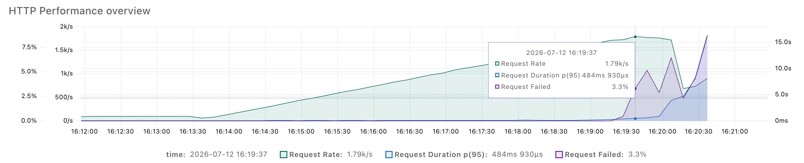

**Note:** The DB nodes ran in a different GCP region because our quota allowed
only eight VMs per region. This adds network overhead, so the result is
conservative and cannot be directly compared to previous results. 

### Overload Protection

To make sure the DB nodes cannot be overloaded when the API tier is scaled out, we implemented two mechanisms that prevent overload and cascading failures: a bulkhead and a circuit breaker. For more details, take a look at the actual [code](services/api/overload.py).

Scaling the API tier out multiplies the load on each DB shard: `N` independent
API nodes can each fan out to the same shard, so a shard's aggregate concurrency
grows linearly with the node count. The DB tier is shuffle-sharded, so the
guards are held **per shard** and a slow or dead shard must not affect the
healthy ones. Every DB call is guarded by self-implemented primitives in
[`services/api/overload.py`](services/api/overload.py):

- **Bulkhead (per shard)** — caps concurrent calls a node makes to *one shard*
  (`DB_SHARD_CONCURRENCY`). Terraform splits each shard's capacity across the
  deployed nodes (`DB_SHARD_CONCURRENCY = ceil(db_shard_capacity /
  api_server_count)`), so `api_server_count * DB_SHARD_CONCURRENCY` stays within
  what one shard can serve, regardless of node count. When no slot frees up
  within `DB_SHARD_ACQUIRE_TIMEOUT` the call is shed, not queued. Because each
  shard has its own bulkhead, a slow shard can only exhaust its own slots, never
  those of healthy shards.
- **Circuit breaker (per shard)** - after `BREAKER_THRESHOLD` consecutive
  failures to a shard it opens and fails fast for `BREAKER_COOLDOWN` seconds
  (then probes once), so a slow or dead shard cannot block API workers on calls
  to it, and only that shard is short-circuited.

The shared httpx connection pool is sized to `len(shards) *
DB_SHARD_CONCURRENCY` so a stalled shard cannot starve the pool and reintroduce
cross-shard coupling.

Just to proof that it is working, we ran a breakpoint test with a low value for `DB_SHARD_CONCURRENCY` and were able to see, that we reach the breakpoint way before the DB was overloaded (DB Saturation < 70%):

**Results of Read-Only Breakpoint Test (Uniform-Distribution, 5 API-Nodes, 1 DB-Node)** 
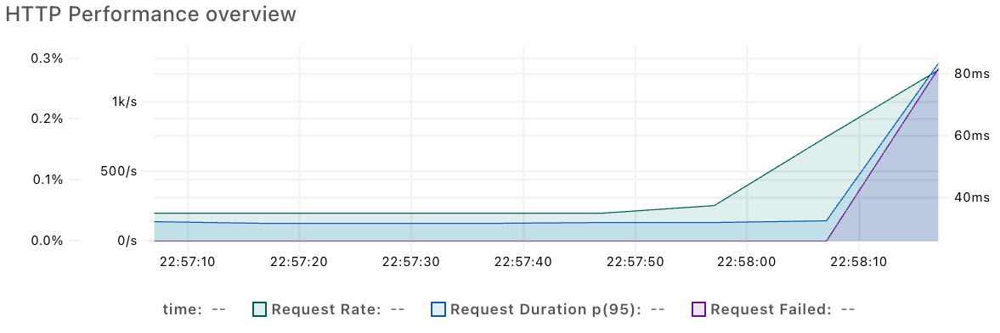
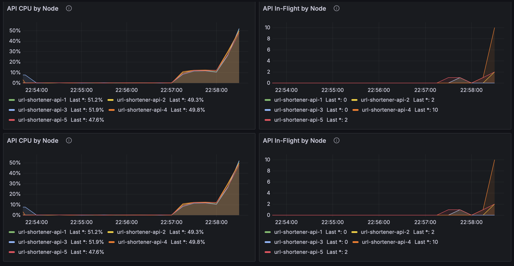
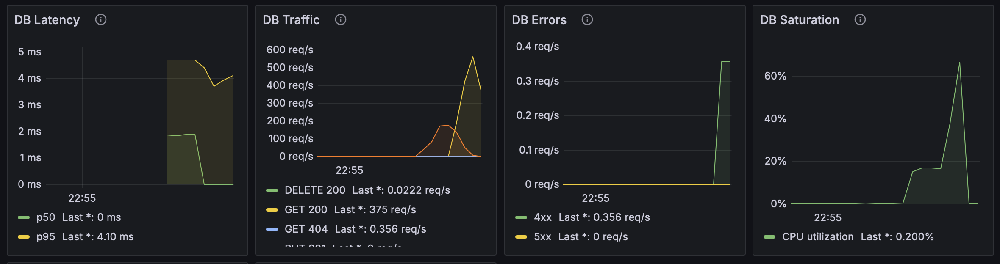

(Important note: For our breakpoint test in the results section we intentionally set the `DB_SHARD_CONCURRENCY` extremly high, since we want to test the actual limits of the system here!)

## Results

We kept the DB tier fixed at 3 nodes and scaled only the API tier. All runs used
the read-only hotspot breakpoint test.

This workload is realistic for a URL shortener: most requests are reads, and a
power-law hotspot distribution models popular short URLs.

`t2d-standard-1` is the older x86 instance type. `c4a-standard-1` is the newer,
more performant ARM instance type.

**Note:** The DB nodes ran in a different GCP region because our quota allowed
only eight VMs per region. This adds network overhead, so the results are
conservative.

| API machine type | API nodes | DB nodes | Breakpoint | Screenshot | Artifacts |
| --- | ---: | ---: | ---: | --- | --- |
| `t2d-standard-1` | 1 | 3 | ~1.03k req/s | 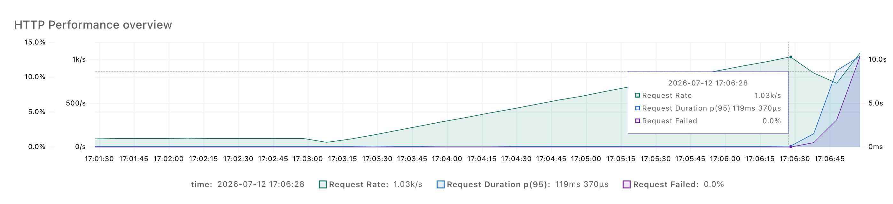 | [HTML](benchmark_results/20260712T150118Z-breakpoint-read-hotspot-report-t2d-standard-1-1_api_node-3_db_nodes.html), [JSON](benchmark_results/20260712T150118Z-breakpoint-read-hotspot-summary-t2d-standard-1-1_api_node-3_db_nodes.json) |
| `t2d-standard-1` | 3 | 3 | ~2.96k req/s | 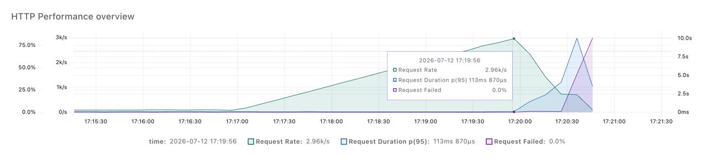 | [HTML](benchmark_results/20260712T151506Z-breakpoint-read-hotspot-report-t2d-standard-1-3_api_nodes-3_db_nodes.html), [JSON](benchmark_results/20260712T151506Z-breakpoint-read-hotspot-summary-t2d-standard-1-3_api_nodes-3_db_nodes.json) |
| `t2d-standard-1` | 5 | 3 | ~4.94k req/s | 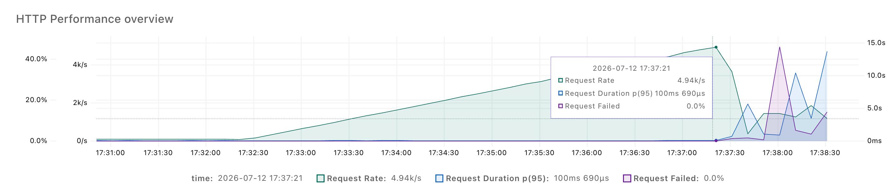 | [HTML](benchmark_results/20260712T153041Z-breakpoint-read-hotspot-report-t2d-standard-1-5_api_nodes-3_db_nodes.html), [JSON](benchmark_results/20260712T153041Z-breakpoint-read-hotspot-summary-t2d-standard-1-5_api_nodes-3_db_nodes.json) |
| `c4a-standard-1` | 1 | 3 | ~1.45k req/s | 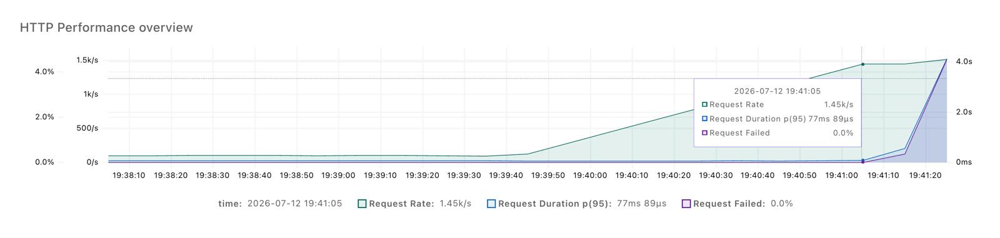 | [HTML](benchmark_results/20260712T173755Z-breakpoint-read-hotspot-report-c4a-standard-1-1_api_node-3_db_nodes.html), [JSON](benchmark_results/20260712T173755Z-breakpoint-read-hotspot-summary-c4a-standard-1-1_api_node-3_db_nodes.json) |
| `c4a-standard-1` | 3 | 3 | ~4.24k req/s | 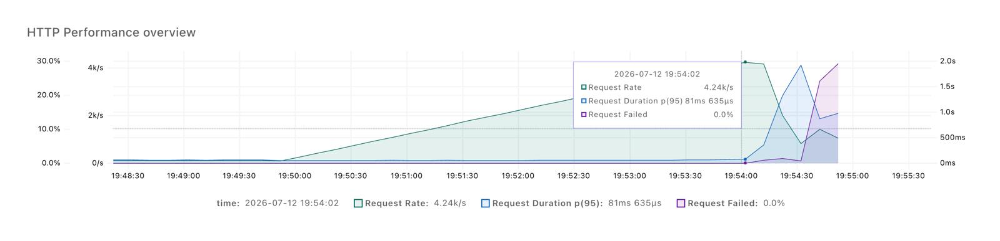 | [HTML](benchmark_results/20260712T174812Z-breakpoint-read-hotspot-report-c4a-standard-1-3_api_nodes-3_db_nodes.html), [JSON](benchmark_results/20260712T174812Z-breakpoint-read-hotspot-summary-c4a-standard-1-3_api_nodes-3_db_nodes.json) |
| `c4a-standard-1` | 5 | 3 | ~5.65k req/s | 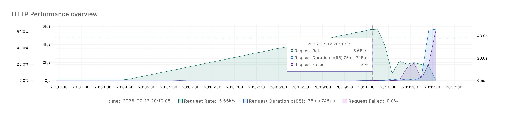 | [HTML](benchmark_results/20260712T180245Z-breakpoint-read-hotspot-report-c4a-standard-1-5_api_nodes-3_db_nodes.html), [JSON](benchmark_results/20260712T180245Z-breakpoint-read-hotspot-summary-c4a-standard-1-5_api_nodes-3_db_nodes.json) |

Throughput scales roughly linearly with the number of API nodes in these runs.
This works because caches and the hotspot distribution let API nodes answer many
requests without contacting the DB tier.

This scaling is not indefinite. The next bottleneck is hard to predict exactly,
but if we keep adding API nodes without scaling DB nodes, the DB tier will
eventually limit throughput.

## Limits

Our prototype scales well for the workloads we tested, but it is not a perfectly
linearly scaling system. The main limitations we are aware of:

- **The API tier cannot be scaled independently forever.** Adding API nodes only
  helps as long as the DB tier can keep up: every additional API node fans out
  to the same shards, so scaling the API tier without scaling the DB tier just
  shifts the bottleneck back to the DB. The overload protection then starts
  shedding load instead of the system going faster. And even when both tiers are
  scaled together, the system does not scale indefinitely — eventually shared
  resources such as the load balancer, the network, or the coordination overhead
  of sharding become the limiting factor.
- **Overload protection sheds load rather than absorbing it.** Once a shard's
  bulkhead is saturated or its circuit breaker is open, requests are shed. This
  keeps the system healthy under overload, but it means throughput is capped and
  some requests fail instead of being served with higher latency.
- **In-memory DB, no durability.** The DB nodes keep all data in a Python hash
  map, so every stored URL is lost when a DB container restarts. Shuffle sharding
  only protects against a single shard being temporarily unavailable, not against
  losing the whole tier or a permanent shard failure. A production system would
  need persistence and real replication.
- **Resharding is not handled.** The number of shards is fixed at deployment
  time. Changing it would remap codes to different shards under rendezvous
  hashing and make part of the existing data unreachable, so the DB tier cannot
  be resized live without a migration step.
- **Increased writes per create request.** With shuffle sharding, each create request       results in a higher number of writes due to the `DB_SHARD_REPLICATION_FACTOR`.
- **The load balancer is a single point of failure.** A single nginx instance
  fronts all API nodes. It can itself become a bottleneck or take the whole
  system down if it fails; a highly available setup would need multiple LBs.
- **Caching helps only for skewed read patterns.** The per-node LRU caches
  reduce DB load only when the access pattern is skewed enough to produce cache
  hits. For a uniform read distribution or a write-heavy workload the DB tier
  remains the limiting factor.

# Planning

Before tackeling the actual implementation we wrote down some initial requirements for our prototype. 

## Functional Requirements

These are just some functional requirements we came up with before we started with the development.

### Create Short URL

The system shall provide:

```http
POST /create
```

Request body:

```json
{
  "url": "https://example.com/some/long/url"
}
```

The `url` query parameter is required and must contain a valid absolute URL.

The system shall generate a unique 8-character alphanumeric code, store it with the original URL, and return:

```json
{
  "shortUrl": "https://domain.com/a1B2c3D4"
}
```

### Access Short URL

The system shall provide:

```http
GET /<code>
```

If `<code>` exists, the system shall redirect to the stored original URL:

```http
302 Found
Location: <original-url>
```

If `<code>` does not exist, the system shall return:

```http
404 Not Found
```
